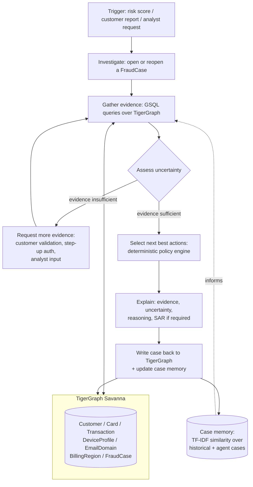

# HHGOA — Agentic Fraud Investigation Agent

Built for **TigerGraph Hacker House Goa 2026** ("Build an AI Agent for Fraud Investigation and Next-Best Action").

An AI agent that investigates card-fraud signals end to end: it opens a case, gathers evidence from a TigerGraph knowledge graph (transactions, cards, devices, billing regions, email domains, prior cases), detects fraud patterns deterministically, assesses how confident it is, decides whether it needs more evidence, recommends and records a next-best action under policy, explains its reasoning, and writes the finished case back into the graph as memory for future investigations.

Dataset: `HHGOA_IEEE` (IEEE-CIS Fraud Detection data from Vesta Corporation — ~590k transactions, ~13.5k customers, six months, with device/identity records and a bank fraud policy, five documented fraud patterns, and closed historical cases).

## Investigation flow

```
Trigger → Investigate → Gather evidence → Assess uncertainty
        → Gather more evidence (if needed) → Take next action(s)
        → Explain the decision → Update case memory
```

This loop is implemented as an explicit LangGraph state graph in `agent/graph_agent.py`, with a bounded number of evidence-request rounds so the agent always terminates with a defensible action rather than looping forever on uncertainty.



## Architecture

| Layer | Where | What it does |
|---|---|---|
| Orchestration | `agent/graph_agent.py` | LangGraph state machine implementing the trigger→...→memory loop |
| Investigation pipeline | `agent/investigation.py` | Drives evidence gathering and LLM synthesis; LLM calls are isolated here and independently testable |
| Pattern detection | `agent/detectors.py` | Deterministic, pure-function detectors for the five known fraud patterns (+ heuristics for undocumented ones) |
| Policy / next-best-action | `agent/policy.py` | Deterministic Fraud Policy v1.0 engine — action selection and approval routing kept separate from LLM reasoning so recommendations are reproducible and auditable |
| Uncertainty assessment | `agent/uncertainty.py` | Structured risk / confidence / evidence-sufficiency / unresolved-questions assessment that decides whether to keep investigating |
| Case memory | `agent/memory.py` | TF-IDF case-narrative embeddings + graph-based similarity search over prior cases (historical + agent-opened) |
| Schemas | `agent/schemas.py` | Pydantic models mirroring the HHGOA_IEEE answer format exactly |
| Graph access | `graph/client.py` + backends | A `GraphClient` protocol with three interchangeable backends (below) |
| Case store / API | `backend/case_store.py` | Data-access layer between the dashboard and the agent pipeline |
| Analyst UI | `frontend/app.py` | Streamlit dashboard — investigation, case progression, evidence, uncertainty, recommendations, next actions |
| Orchestration scripts | `scripts/` | `setup_graph.py` (schema + load), `run_case.py` (single case), `run_benchmark.py` (all 20 benchmark cases) |

### Graph backends (`graph/`)

Three implementations of the same `GraphClient` interface, so the agent code never changes based on which is active:

- **`tigergraph_backend.py`** — direct connection via `pyTigerGraph`, calling the 10 installed GSQL queries in `graph/gsql/queries.gsql` against TigerGraph Savanna.
- **`tigergraph_mcp_backend.py`** — the same calls routed through the **TigerGraph MCP server** instead of a direct connection, satisfying the challenge's MCP requirement literally.
- **`local_backend.py`** — an in-memory pandas fallback for fast local development/testing without a live graph.

Select the backend with `GRAPH_BACKEND` in `.env` (`tigergraph` | `tigergraph_mcp` | `local`).

### Graph schema (`graph/schema/schema.gsql`)

7 vertex types (`Customer`, `Card`, `Transaction`, `DeviceProfile`, `EmailDomain`, `BillingRegion`, `FraudCase`) and their edges (`OWNS`, `MADE`, `FROM_DEVICE`, `PURCHASER_EMAIL`, `RECIPIENT_EMAIL`, `BILLED_IN`, `NEXT`, `INVOLVES`, `ON_CARD`, `CONNECTED_TO`, `CASE_DEVICE`). A single unified `FraudCase` vertex holds both the seeded historical closed cases and every case the agent opens (`case_source`: `historical` | `agent`), so case-memory retrieval covers both pools uniformly. `card_id`/`device_key` are derived deterministically (see `graph/derive.py`) and shared between the local and real backends so they can never drift.

10 installed GSQL queries (`graph/gsql/queries.gsql`) cover transaction detail lookup, card transaction windows, customer profile, device/email/region neighbors, card region history, velocity checks, case-similarity search (cosine similarity over TF-IDF embeddings), and case upsert (the graph write-back).

### GraphRAG

Rather than handing the LLM raw rows, `agent/investigation.py` assembles a structured evidence context from graph query results plus the bank's fraud policy and the five documented fraud-pattern definitions, and passes that synthesized context to the LLM for reasoning, evidence synthesis, and explanation generation — graph traversal and pattern/policy matching stay deterministic; the LLM is used for reasoning and narrative, not decisioning.

## Setup

```bash
python -m venv .venv
.venv\Scripts\activate        # Windows
pip install -r requirements.txt

cp .env.example .env          # fill in your LLM + TigerGraph credentials
```

`.env` controls the LLM provider (Anthropic or Gemini), the graph backend, and TigerGraph Savanna connection details (`TG_HOST`, `TG_GRAPH_NAME`, `TG_SECRET` — Savanna auth is Database-Secret only, not username/password). See `.env.example` for every option.

### Provision the graph (TigerGraph Savanna)

```bash
python scripts/setup_graph.py --reset --all
```

Creates the schema, installs all 10 queries, and loads the full dataset (customers, cards, ~122k transactions, devices, email domains, billing regions, historical closed cases). `--reset` drops and recreates the catalog first (`CREATE VERTEX`/`EDGE` are not idempotent in GSQL, so this is needed on any rerun after a partial failure).

### Run an investigation

```bash
python scripts/run_case.py --case-id HHG-001 --backend tigergraph
python scripts/run_benchmark.py --backend tigergraph   # all 20 benchmark cases
```

Each run produces a case answer file under `cases/` (investigation record, evidence, findings, decisions, actions taken, SAR when required by policy, and the next-best-action recorded both before and after any additional evidence is requested) and writes the case into the graph.

### Analyst dashboard

```bash
streamlit run frontend/app.py
```

## Status

All 10 GSQL queries and the full schema are deployed on TigerGraph Savanna; the complete dataset (~122k transactions) is loaded. The agent has been validated end to end against the live graph, and all 20 benchmark cases (`scripts/run_benchmark.py --backend tigergraph`) complete successfully, each producing a case file and a graph write-back.

## Repository layout

```
agent/        deterministic + LLM-driven investigation logic
backend/      case store / data access for the dashboard
frontend/     Streamlit analyst dashboard
graph/        schema, GSQL queries, and the three GraphClient backends
scripts/      setup / single-case / benchmark runners
tests/        unit tests (policy engine, graph agent, TigerGraph reshaping)
cases/        benchmark case outputs (the submission's answer files)
graph_mirror/ local mirror of what was written to the graph
docs/         engineering decision log (docs/DECISIONS.md)
data/         dataset (not committed — see .gitignore)
```

## Design principles

- Fraud scoring, policy/action selection, and pattern detection are **deterministic** — reproducible and auditable, never left to LLM judgment.
- The LLM is used only for reasoning, evidence synthesis, and generating human-readable explanations.
- Every external response (LLM and TigerGraph) is validated before use.
- No secrets in code — all credentials are environment-driven (`.env`, gitignored).
- `graph/local_backend.py` and the real TigerGraph backends share derivation logic (`graph/derive.py`) so they can never disagree on IDs.

## License

Built for the TigerGraph Hacker House Goa 2026 hackathon.
